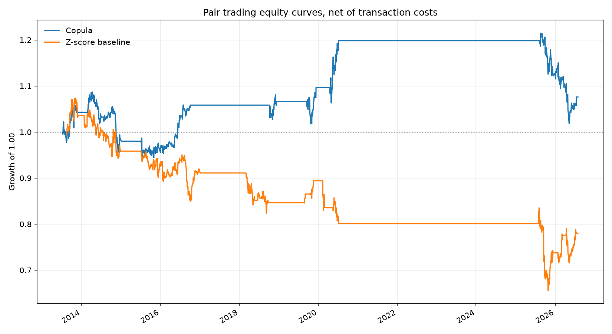
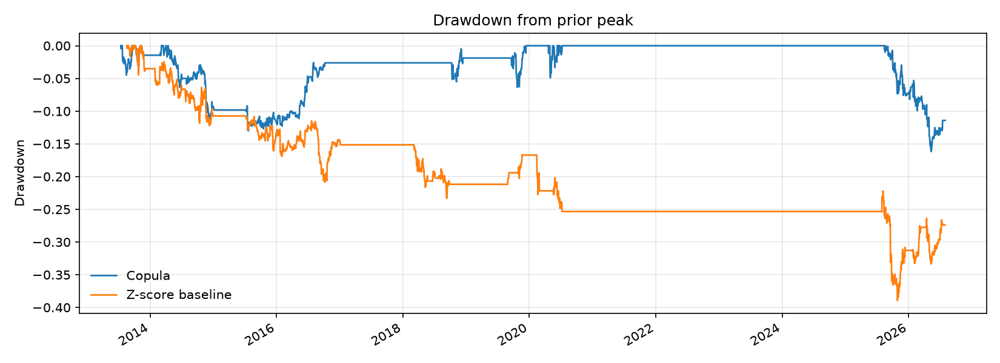

# Copula Pairs Trading

Statistical arbitrage on S&P 100 pairs. Pairs are selected with Johansen cointegration testing, and entry and exit rules are driven by a fitted copula rather than a linear spread Z-score.

## Why Copulas

Standard pairs trading assumes the spread between two cointegrated names is normally distributed, then trades deviations from its mean. That assumption fails in the tails, which is exactly where the trades are. A copula separates the marginal distribution of each leg from the dependence structure between them, so tail dependence can be modeled directly instead of assumed away.

The trade signal becomes a conditional probability. Given where asset A sits in its own distribution, how unusual is asset B's position? Positions open when that conditional probability crosses a threshold.

## Method

**1. Pair formation.** Screen S&P 100 constituents for cointegration using the Johansen trace test. Retain pairs significant at the chosen level over the formation window.

**2. Marginal fitting.** Fit empirical or parametric marginals to each leg's returns.

**3. Copula selection.** Fit candidate families (Gaussian, Student t, Clayton, Gumbel, Frank) and select by Kolmogorov-Smirnov statistic. Clayton and Gumbel are included specifically because they capture asymmetric lower and upper tail dependence.

**4. Signal generation.** Compute the conditional distribution function of each leg given the other. Enter when it breaches the entry threshold, exit on reversion to the neutral band or on stop.

**5. Execution.** Dollar-neutral legs, sized by the cointegration vector.

## Parameters

| Parameter | Default |
|---|---|
| Universe | S&P 100 |
| Formation window | 12 months |
| Trading window | 6 months |
| Entry threshold | 0.05 / 0.95 |
| Exit band | 0.45 to 0.55 |
| Stop | Time-based on trading window close |

## Repository Layout

```
copula-pairs-trading/
|
|-- README.md
|-- LICENSE
|-- .gitignore
|-- requirements.txt
|
|-- src/
|   |-- __init__.py
|   |-- copula.py
|   |-- screen.py
|   `-- signal.py
|
|-- strategies/
|   |-- __init__.py
|   |-- copula_pairs.py
|   `-- zscore_pairs.py
|
|-- docs/
|   |-- methodology.md
|   `-- roadmap.md
|
|-- results/
|   `-- .gitkeep
|
|-- tests/
|   |-- __init__.py
|   |-- test_copula.py
|   `-- test_screen.py
```

## Setup

```bash
python -m venv .venv
source .venv/bin/activate
pip install -r requirements.txt
```

## Usage

Reproduce every published number with one command:

```bash
python run_results.py --fdr 0.20 --max-half-life 90
```

This downloads the universe from Yahoo Finance, caches prices and screening
output to `cache/`, rolls the formation and trading windows forward, runs both
strategies on identical pairs, and writes `results/summary.csv`,
`results/summary.md`, and the figures under `docs/images/`.

Verify the pipeline without a network first:

```bash
python run_results.py --offline
```

All settings live in `config.py`. Screening dominates runtime and is cached,
so parameter sweeps on cost or entry thresholds are fast after the first run.

## Tests

```bash
python -m pytest tests -q
```

18 tests covering copula fitting and selection, false discovery rate control, half life estimation, and entry hysteresis.

## Results

Reproduce with `python run_results.py --fdr 0.20 --max-half-life 90`. Full
statistics and every run parameter are written to
[results/summary.md](results/summary.md).

**Trading period 2013-07 to 2026-07.** 48 names, 252-day formation window,
126-day trading window rolled forward without overlap, weekly signal
evaluation, 10 bps one-way costs. Both strategies trade identical pairs on
identical dates, so the comparison isolates the signal rule.

| Strategy | CAGR | Volatility | Sharpe | Max Drawdown | Time in Market | Avg Gross Exposure | Avg Turnover |
|---|---|---|---|---|---|---|---|
| Copula | 0.57% | 5.42% | 0.10 | -16.18% | 29.95% | 0.28 | 0.009 |
| Z-score baseline | -1.91% | 6.93% | -0.28 | -38.95% | 32.45% | 0.31 | 0.012 |





### The screen is the binding constraint

The headline result is not the strategy comparison. It is that **19 of 31
formation windows produced no tradeable pairs at all**, and that is with the
false discovery rate loosened to 0.20 and the half-life cap raised to 90 days,
both weaker than the defaults in `config.py`.

| Windows | 31 |
|---|---|
| Windows with zero pairs | 19 |
| Mean pairs per window | 1.7 |
| Windows hitting the 10-pair cap | 4 |

Cointegration among large-cap US equities over 2010 to 2026 is rare, unstable,
and clustered. Windows 10, 11, 30, and 31 hit the cap while the windows
immediately around them found nothing. The strategy is flat 70% of the time
not by design but because there is nothing to trade, and the equity curve is
visibly flat from mid-2020 to late 2025 for that reason.

This is the practical constraint on the whole approach, and it is invisible if
you report only return statistics.

### The head-to-head is underpowered

The copula rule beat the Z-score baseline on every measure: positive rather
than negative return, lower volatility, and less than half the drawdown. The
2026 collapse in the baseline is the clearest separation, and it is consistent
with the mechanism the method predicts, since a Gaussian-equivalent spread rule
has no way to distinguish joint tail moves from ordinary dispersion.

That said, **this sample cannot settle the question.** Twelve non-empty windows,
a mean of 1.7 pairs each, and a large share of total P&L concentrated in the
final two windows. The difference in Sharpe is not something the data can
support at conventional significance, and it is not claimed here.

### Concentration

`positions_to_weights` splits capital evenly across *active* pairs, so a window
holding one pair puts 50% long in one name and 50% short in another. Maximum
gross exposure reached 1.00 against an average of 0.28. Given how thin the
screen is, the book was frequently a concentrated two-name bet rather than a
diversified pair portfolio. Position sizing against a target pair count, rather
than the realised count, is the obvious next change.

### Reading the hit rate

`results/summary.csv` reports a 14.75% hit rate for the copula. That is a share
of all days, roughly 70% of which are flat. Of days actually in the market,
close to half were positive.

## Limitations

- **Screen sparsity dominates.** With 19 of 31 windows empty, results are
  driven by a handful of periods. Any conclusion here is a statement about
  those periods, not about the method in general.
- **Sample size.** Twelve non-empty windows averaging 1.7 pairs cannot
  distinguish two signal rules at conventional significance.
- **Concentration.** Even sizing across active pairs produces 50/50 single-name
  exposure when only one pair survives. Gross exposure reached 1.00.
- **Cointegration instability.** Relationships identified in the formation
  window frequently break inside the trading window. This is the assumption the
  whole method rests on and it is the weakest one.
- **No borrow cost or short availability.** Both bind in practice and neither is
  modelled.
- **Selection bias in the universe.** The 48 names all exist today with
  continuous history since 2010.
- **Copula family selection by KS distance** cannot reliably separate Gaussian
  from Frank on symmetric data. See [docs/methodology.md](docs/methodology.md).

## License

MIT

---

*Research code. Not investment advice.*
